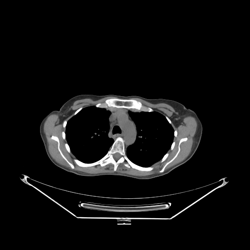
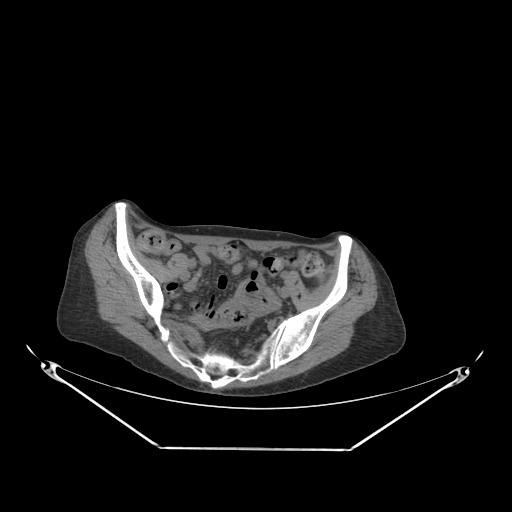
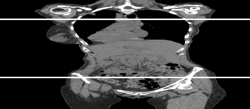
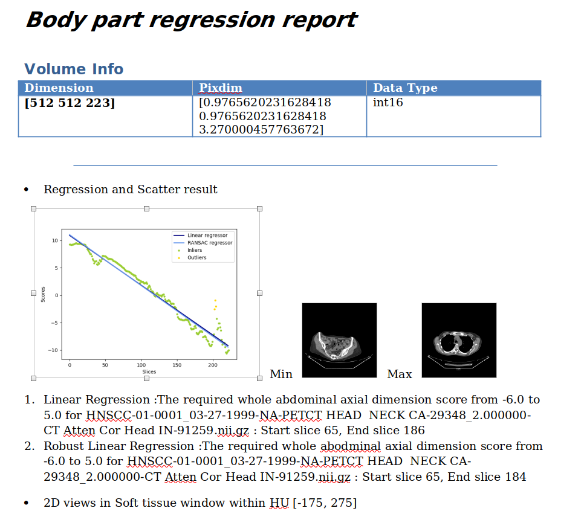

# Description

The body part regression usage pipelines.

# Model Overview

Version 1: The body part regression model trained with basic unet with extensive datasets. 


BPR identification of upper bound given an abodmen score range

BPR identification of lower bound given an abodmen score range

Coronal view of the BPR identification bounds

# Input Images
The nii.gz format NIFTI files are required. Check where the CT images are axial reconstrcuted and in 512x512xz shape. 
Put CT images in 
```
<root_path>/datasets/images
```

## Training Configuration

The training was performed with at least 16GB-memory GPUs.


## Commands Example

Execute :


```bash
# cd to the bpr pipeline fodler, set root path and datasets path, run
python code/main.py --root_path <root_path> --data_dir <data_dir> --checkpoint_BPR <file path to download>
```

Pre-trained checkpoints will be automatically downloaded.

The output BPR result list will be in:
```bash
<root_path>/txt_info/BPR_result_list.txt
```

The BPR doc reports will be generated in:
```bash
<root_path>/datasets/BPR_reports
```

A sample output report: 



# Disclaimer

This is an example, not to be used for diagnostic purposes.

